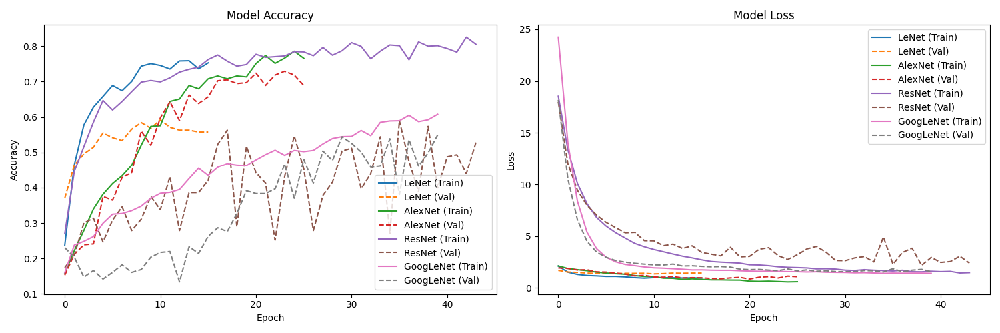
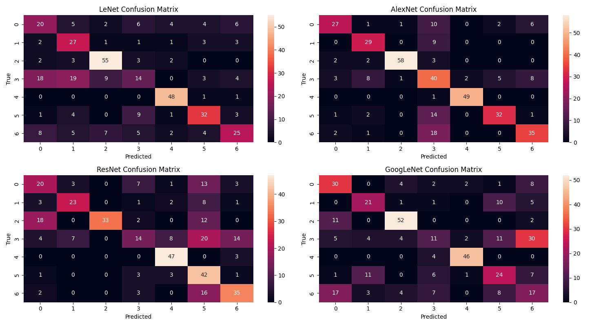

# EEG-Based Brain Disorder Classification

This project implements and compares various machine learning and deep learning models for classifying EEG data into 7 classes. The models include:

-   **LeNet**
-   **AlexNet**
-   **ResNet**
-   **GoogLeNet**

---

## Table of Contents

1. [Introduction](#introduction)
2. [Dataset](#dataset)
3. [Project Workflow](#project-workflow)
4. [How to Run the Project](#how-to-run-the-project)
5. [Python Notebooks](#python-notebooks)
6. [Results](#results)
7. [Conclusion](#conclusion)
8. [Future Work](#future-work)
9. [Acknowledgments](#acknowledgments)

---

## Introduction

Electroencephalography (EEG) is a widely used technique to measure electrical activity in the brain. This project focuses on classifying EEG data into 7 distinct classes based on preprocessed features. The dataset undergoes preprocessing steps such as PCA for dimensionality reduction and SMOTE for class balancing. The models are trained and evaluated using metrics like accuracy, confusion matrices, and classification reports.

---

## Dataset

The dataset used in this project is `EEG.machinelearing_data_BRMH.csv`, which contains EEG features and corresponding labels. Key details:

-   **Features**: EEG signals processed into numerical features.
-   **Target**: `main.disorder` column, representing 7 classes of disorders.
-   **Preprocessing**:
    -   Removal of low-variance features.
    -   Imputation of missing values.
    -   Dimensionality reduction using PCA (99% variance retained).
    -   Class balancing using SMOTE.

---

## Project Workflow

1. **Data Preprocessing**:

    - Load the dataset.
    - Encode categorical columns.
    - Apply PCA for dimensionality reduction.
    - Balance the dataset using SMOTE.

2. **Model Training**:

    - Train deep learning models (LeNet, AlexNet, ResNet, GoogLeNet) on the preprocessed data.
    - Use data augmentation during training to improve generalization.

3. **Evaluation**:
    - Evaluate models using accuracy, confusion matrices, and classification reports.
    - Compare model performance using training and validation accuracy/loss plots.

---

## How to Run the Project

### Prerequisites

Ensure you have the following installed:

-   Python 3.8 or higher
-   pip (Python package manager)

### Step 1: Clone the Repository

Clone the repository to your local machine:

```bash
git clone https://github.com/TitanBrainz/EEG-Based-Brain-Disorder-Classification.git
cd EEG-Based-Brain-Disorder-Classification
```

### Step 2: Create a Virtual Environment

Create and activate a virtual environment:

```bash
python -m venv .venv
source .venv/bin/activate  # On Windows: .venv\Scripts\activate
```

### Step 3: Install Requirements

Install the required Python packages:

```bash
pip install -r requirements.txt
```

### Step 4: Run the Training Script

Run the following command to start training and evaluation:

```bash
python train_compare_models.py
```

### Step 5: Test the Model

Use the `test_realtime.py` script to test the trained model with sample or custom data:

```bash
python test_realtime.py
```

---

## Python Notebooks

The repository also includes Python notebooks for detailed experimentation and visualization:

-   `Final_EEG_Models(12class).ipynb`: Notebook for 12-class classification.
-   `Final_EEG_Models(7class).ipynb`: Notebook for 7-class classification.

---

## Results

The models were evaluated on their ability to classify EEG data into 7 classes. Key metrics include:

-   **Accuracy**: Training and validation accuracy for each model.
-   **Confusion Matrices**: Visual representation of true vs. predicted labels.
-   **Classification Reports**: Precision, recall, and F1-score for each class.

### Output Plots

#### Training and Validation Accuracy Comparison



#### Confusion Matrices



---

## Conclusion

This project demonstrates the effectiveness of deep learning models in classifying EEG data. By leveraging advanced architectures like ResNet and GoogLeNet, the models achieve high accuracy and robust performance across all classes.

---

## Future Work

-   Extend the classification to additional EEG datasets for broader generalization.
-   Explore transfer learning with pre-trained models for improved performance.
-   Implement real-time EEG signal classification using streaming data.
-   Optimize hyperparameters using advanced techniques like Bayesian optimization.

---

## Acknowledgments

Special thanks to the contributors of the dataset and the developers of the libraries used in this project.
